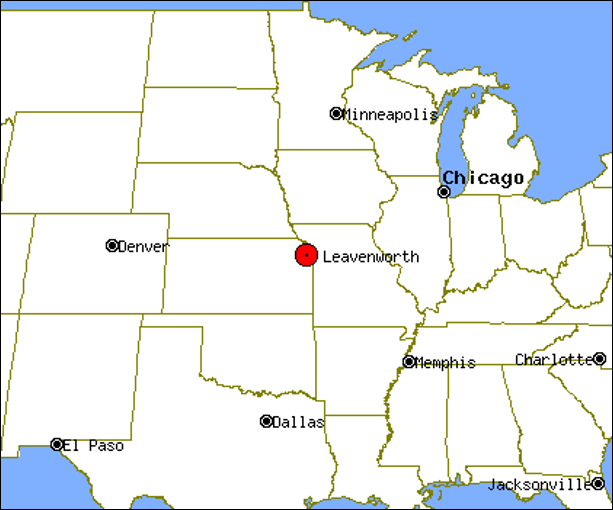
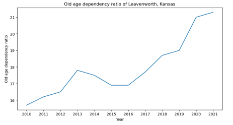
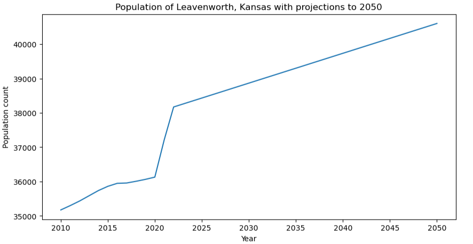
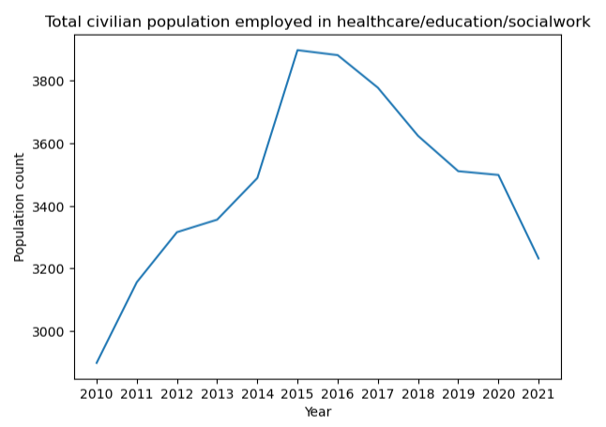
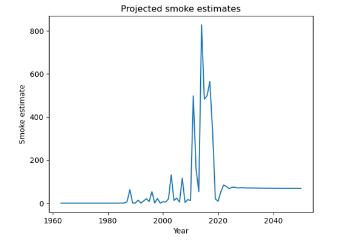
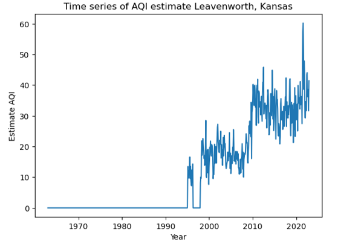
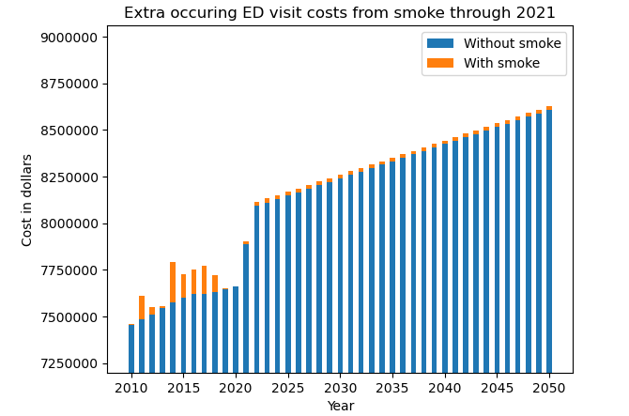

# NOTE:
This work was accomplished for a University of Washington MSDS course.  
The analyses in this work should not be assumed to be correct.  

# Analysis of the wildfire smoke impact on the healthcare industry in Leavenworth, Kansas
This work is designed to answer a specific human-related issue.  
Specifically, this project aims to measure the impact that wildfire smoke has on Leavenworth, Kansas.  
Specifically, this work looks at healthcare data, population data, and specific diseases.    

# Information about Leavenworth, Kansas
Population: 37081  
Founded: 1854  
Area: 24.31 square miles  
Median age (2021): 36.9  
County: Leavenworth  
Coordinates: 39°19′22″N 94°55′27″W  
Wikipedia link: https://en.wikipedia.org/wiki/Leavenworth,_Kansas 



# What was accomplished? 
```
In this work I explored how the healthcare industry of Leavenworth Kansas was impacted
by wildfire smoke by reading in various datasources, combining them, making projections, and using visualizations.

Given my explorations, I ended up making a final policy recommendation for the city council.  
```

# Why does this matter?
```
Wildfire smoke is dangerous to inhale over both the short and the long term.  
This comes with associated economic and health costs.  
To attempt to minimize future costs, policymakers need to be informed about current/future trends regarding wildfire smoke. 
```

# Policy recommendation made to the city council
```
Given the analysis findings:
1. No need for drastic action
2. Continue to monitor the situation
3. Issue stay at home recommendations when AQI is at unhealthy levels
4. Increase public awareness
5. Consider subsidizing healthcare industry to combat declining workforce
```

# What lead you to making that specific policy recommendation?
### Part 1
```
The healthcare industry is going to have their work cut out for them in the future for three main reasons.
1. The population of Leavenworth, Kansas is rising according to projections.
2. The old age depedency ratio of Leavenworth, Kansas is rising.
3. The number of healthcare workers is declining in recent years.  
```




### Part 2
```
The amount of wildfire smoke Leavenworth receives is increasing. This is partially supported by AQI measurements. 

For example, our estimates show the AQI has been steadily increasing in Leavenworth. 
Additionally, our custom smoke estiamte + projection model predicts a slight increase in wildfire smoke through 2050. 
```




#####  Comparison of smoke estimate to AQI
```
As shown above, there seems to be a slight trend agreement between AQI and my smoke estimate for a few years. However, my smoke estimate scaling is an order of magnitude larger. Additionally, data was sparse for both problems, required a lot of averaging over time, and was calculated using multiple (likely bad) assumptions. Therefore, given all of the issues presented I believe it is safe to say my smoke estimate is bad. 
```

### Part 3
```
Long term exposure to wildfire smoke exacerbates health issues. Thus, the increasing smoke will lead to increased Emergency Department (ED) visits.
```


# How can this work be extended?
```
This work makes a lot of assumptions and uses many estimates.  
The biggest way to improve this work out of the gate is to do extensive research
looking into each of the estimates/research applications used in this work and make sure they are valid. Specific assumptions and estimates made will be talked about below.  
```

# Assumptions/Estimates
##### Annual smoke estimate
```
The estimate for annual smoke that I came up with is very simple. 
In this estimate I try to incorporate the volume of smoke burned by wood, the amount of 
wood burned, and the distance from the wildfire to Leavenworth. 
Unfortunately, this estimate is probably very inaccurate.

Formula: Smoke_impact_from_fire = (area_forest_burned * 10 * 87.5) / (distance_from_city^5)
To get the annual smoke estimate, we sum the smoke_impact_from_fire over every fire.

Assumptions made:
1. The volume of smoke produced by wood is 87.5 M^2 per kg. 
http://virtual.vtt.fi/virtual/innofirewood/stateoftheart/database/burning/burning.html
2. There is 10 kilograms of wood on average per square meter in a forest. (No source)
3. Smoke dispersion is inversely proportional to the distance to the fifth power. (Did this to keep relative scale low)

Reasons this estimate is bad:
1. The volume of smoke produced by wood depends on the type of tree.
2. More than just wood burns in a wildfire. 
3. The amount of wood on average per square meter in a forest varies on the type of flora present, the season, and other various factors.
4. Smoke dispersion is much more complicated than what I have proposed. There have been many studies on atmospheric transport models, which are much better estimates than what we have. However data for atmospheric transport models probably does not exist for our data (especially for the old stuff). 
5. Other factors that I'm not aware of

Notes:  
Overall, I decided the smoke estimate should be summed during the year because data is sparse. This means if we were to use a finer time scale we would end up with a lot of missing data that we would either have to set as an average or 0 in order to do time-series analysis. 

I did not see a reason to only use wildfires from the fire season, as smoke can effect a city at any time of the year. 

I looked for sources talking about the amount of wood per square meter in a forest but could not find anything. Therefore I arbitrarily picked a number, as the amount of smoke would scale linearly, so in terms of tracking relative change it wouldn't affect much. 
```
##### AQI estimate
```
AQI stands for Air Quality Index, which is just a number from 0-500 that quantifies how hazardous
the air currently is. AQI measures carbon monoxide, nitrogren dioxide, ozone health, particle pollution, and sulfur dioxide. 

In this work, since we are dealing with wildfire data, we only will consider particulates when dealing with AQI. More specifically, we will only include data that measures PM10 and PM2.5 which respectively measure particles less than 10 micrometers and particles less than 2.5 micrometers in size. 
```

#### Leavenworth population Estimates
#### Leavenworth healthcare employment estimate
#### Leavenworth old age depedency ratio estimate
#### Leavenworth uninsured percentage estimate
```
All of these estimates, which are derived from US census data, are assumed to be accurate and representative of the population. 
```
#### Number of ED visits per year
#### Increase in ED visit risk per 5 conditions due to wildfire smoke
```
Asthma
CVD
COPD
Heart attack
Stroke
```

# Data sources:
##### Wildfire data
```
1. Name:  
        Combined wildland fire datasets for the United States and certain territories,   
        1800s-Present (combined wildland fire polygons)    
   Description:  
        Combination of many smaller/incomplete United States fire datasets. "Encompasses  
        known wildfires and prescribed fires within the United States and certain territories."[1]  
        In this project USGS_Wildland_Fire_Combined was used.  
   URL:  
        https://www.sciencebase.gov/catalog/item/61aa537dd34eb622f699df81    
   Schema/Info:     
        An example of the data used to store a wildfire is:
        {
            "attributes": {
              "OBJECTID": 1,
              "USGS_Assigned_ID": 1,
              "Assigned_Fire_Type": "Wildfire",
              "Fire_Year": 1860,
              "Fire_Polygon_Tier": 1,
              "Fire_Attribute_Tiers": "1 (1)",
              "GIS_Acres": 3940.20708940724,
              "GIS_Hectares": 1594.5452365353703,
              "Source_Datasets": "Comb_National_NIFC_Interagency_Fire_Perimeter_History (1)",
              "Listed_Fire_Types": "Wildfire (1)",
              "Listed_Fire_Names": "Big Quilcene River (1)",
              "Listed_Fire_Codes": "No code provided (1)",
              "Listed_Fire_IDs": "",
              "Listed_Fire_IRWIN_IDs": "",
              "Listed_Fire_Dates": "Listed Other Fire Date(s): 2006-11-02 - NIFC DATE_CUR field (1)",
              "Listed_Fire_Causes": "",
              "Listed_Fire_Cause_Class": "Undetermined (1)",
              "Listed_Rx_Reported_Acres": null,
              "Listed_Map_Digitize_Methods": "Other (1)",
              "Listed_Notes": "",
              "Processing_Notes": "",
              "Wildfire_Notice": "Wildfire mapping prior to 1984 was inconsistent, infrequent, and done
              without the aid of more modern fire mapping methods (GPS and satellite imagery). Areas 
              burned prior to 1984 in this dataset represent only a fraction of what actually burned.
              While areas burned on or after 1984 are much more accurate and complete, errors still 
              can and do occur. This dataset represents the most complete set of digitized polygon 
              fire data available to the public that we, the authors, were able to collect. It is not 
              a complete collection of all wildfires burned during the time period it represents.",
              "Prescribed_Burn_Notice": "Prescribed fire data in this dataset represents only a 
              fraction of the area burned in prescribed burns across all years due to lack of 
              reporting, particularly on private lands. The missing prescribed burn data becomes more
              pronounced further back in time, particularly in the southeastern U.S.; however, errors
              and omissions still occur through the most recent years in this dataset. This dataset
              represents the most complete set of digitized polygon fire data available to the 
              public that we, the authors, were able to collect. It is not a complete collection of
              all prescribed burns burned during the time period it represents.",
              "Wildfire_and_Rx_Flag": null,
              "Overlap_Within_1_or_2_Flag": null,
              "Circleness_Scale": 0.04758958417643999,
              "Circle_Flag": null,
              "Exclude_From_Summary_Rasters": "No",
              "Shape_Length": 64888.449849380544,
              "Shape_Area": 15945452.365353702
            },
            "geometry": {
                "rings": [.....]
            },
        }
```
##### AQI data
```
1. Name:  
   Description:  
        What is AQI?
        https://ecology.wa.gov/Research-Data/Monitoring-assessment/Air-Quality-Index  
        AQI stands for Air Quality Index, which is just a number from 0-500 that quantifies how hazardous
        the air currently is. AQI measures carbon monoxide, nitrogren dioxide, ozone health, particle pollution, and sulfur dioxide. 
        In this work, since we are dealing with wildfire data, we only will consider particulates when dealing with AQI. More specifically, we will only include data that measures PM10 and PM2.5 which respectively measure particles less than 10 micrometers and particles less than 2.5 micrometers in size (diameter?).
   URL:  
        https://aqs.epa.gov/aqsweb/documents/data_api.html 
   Schema/Info:     
        {
			  "Header": [
				{
				  "status": "success",
				  "request_time": "2018-06-13T07:45:01-04:00",
				  "url": "https://...",
				  "rows": 1
				}
			  ],
			  "Body": [
				{
				  "state_code": "01",
				  "county_code": "073",
				  "site_number": "0023",
				  "parameter_code": "88101",
				  "poc": 1.0,
				  "latitude": 33.0,
				  "longitude": -86.0,
				  "datum": "WGS84",
				  "parameter_name": "PM2.5 - Local Conditions",
				  "date_local": "2017-04-01",
				  "time_local": "00:00",
				  "date_gmt": "2017-04-01",
				  "time_gmt": "06:00",
				  "sample_measurement": 6.2,
				  "unit_of_measure": "Micrograms/cubic meter (LC)",
				  "detection_limit": 2.0,
				  "uncertainty": null,
				  "qualifiers": null,
				  "method_type": "FRM",
				  "method_code": "142",
				  "method_name": "BGI Models PQ200-VSCC or PQ200A-VSCC - Gravimetric",
				  "state_name": "Alabama",
				  "county_name": "Jefferson",
				  "date_of_last_change": "2017-05-30",
				  "cbsa_code": "13820"
				}
			  ]
		}
```
##### Census data
```
Description:
    This work utilized United States census data, which can be found at https://data.census.gov/. United States census data is quite vast and can include many different schemas which cannot be fully described here. For this work specifically, population estimates, age estimates, healthcare coverage estimates, and employment by industry estimates were used. 

    Data downloaded has three files per year, below are some examples:
    1. ACSST5Y2010.20101-Column-Metadata.csv - Describes what each column in the Data file stands for
    2. ACSST5Y2010.20101-Data.csv            - The quantitative data we use in our analyses
    3. ACSST5Y2010.20101-Table-Notes.txt     - Extra metadata describing how certain fields were calculated, 
                                               how estimates were made, etc.
URLs: 
    https://data.census.gov/
    https://data.census.gov/table/ACSST5Y2021.S2407?q=Leavenworth%20city,%20Kansas&t=Class%20of%20Worker - Employment type
    https://data.census.gov/table/ACSSE2022.K201803?q=Leavenworth%20city,%20Kansas&t=Disability - Disability types and percentages
    https://data.census.gov/table/ACSSE2022.K201801?q=Leavenworth%20city,%20Kansas&t=Health - Disability by age
    https://data.census.gov/table/ACSST5Y2021.S0101?q=Leavenworth%20city,%20Kansas&t=Age%20and%20Sex - Age and Sex
    https://data.census.gov/table/ACSST5Y2022.S2701?q=Leavenworth%20city,%20Kansas&t=Health%20Insurance - Health insurance
Schema/INFO:
    There are too many files to describe them all. However, here is a short example of a metadata file. 
    The main point to takeaway is that all of the files are csvs with
    header column names that will need to be looked up. 
    Column Name	Label  
    GEO_ID	Geography  
    NAME	Geographic Area Name  
    S2701_C01_001E	Total!!Estimate!!Total civilian noninstitutionalized population  
    S2701_C01_001M	Total!!Margin of Error!!Total civilian noninstitutionalized population  
    S2701_C02_001E	Number Uninsured!!Estimate!!Total civilian noninstitutionalized population  
    ...  
    S2701_C01_054M	Total!!Margin of Error!!PERCENT IMPUTED!!Health insurance coverage!!Public coverage!!VA Health Care  
    S2701_C02_054E	Number Uninsured!!Estimate!!PERCENT IMPUTED!!Health insurance coverage!!Public coverage!!VA Health Care  
    S2701_C02_054M	Number Uninsured!!Margin of Error!!PERCENT IMPUTED!!Health insurance coverage!!Public coverage!!VA Health Care  
    S2701_C03_054E	Percent Uninsured!!Estimate!!PERCENT IMPUTED!!Health insurance coverage!!Public coverage!!VA Health Care  
    S2701_C03_054M	Percent Uninsured!!Margin of Error!!PERCENT IMPUTED!!Health insurance coverage!!Public coverage!!VA Health Care  
```

# Description of all project directories and files
```
./Archive/ - Collection of example files or files that are no longer needed
    1. ./Archive/epa_air_quality_history_example.ipynb - Example of requesting data from the EPA AQS api. 
    2. ./Archive/wildfire_geo_proximity_example.ipynb - Example of how to perform distance calculations on
                                              geodectic data as well as load in/process geojson data.  
```

```
./Data/ - Directory of all relevant data files to this project. Most data is gitingored.   
    1. ./Data/USGS_Wildland_Fire_Combined_Dataset.json - Wildland Fire polygons in GeoJSON format
    2. ./Data/USGS_Wildland_Fire_Combined_WithDistances.json - Wildland Fire polygons in GeoJSON format
                                                        that include the average distance from the
                                                        polygon points to Leavenworth, Kansas
    3. ./Data/AgeAndSex/
            ACSST5Y2010.S0101-Column-Metadata.csv - Describes what each column in the Data file stands for
            ACSST5Y2010.S0101-Data.csv - The quantitative data we use in our analyses
            ACSST5Y2010.S0101-Table-Notes.txt - Extra metadata describing how certain fields were calculated
            ...
            ...
            ...
            ACSST5Y2021.S0101-Column-Metadata.csv - Describes what each column in the Data file stands for
            ACSST5Y2021.S0101-Data.csv - The quantitative data we use in our analyses
            ACSST5Y2021.S0101-Table-Notes.txt - Extra metadata describing how certain fields were calculated
    4. ./Data/DisabilityByAge/
            ACSSE2014.K201801-Column-Metadata.csv - Describes what each column in the Data file stands for
            ACSSE2014.K201801-Data.csv - The quantitative data we use in our analyses
            ACSSE2014.K201801-Table-Notes.txt - Extra metadata describing how certain fields were calculated
            ...
            ...
            ...
            ACSSE2022.K201801-Column-Metadata.csv - Describes what each column in the Data file stands for
            ACSSE2022.K201801-Data.csv - The quantitative data we use in our analyses
            ACSSE2022.K201801-Table-Notes.txt - Extra metadata describing how certain fields were calculated
    5. ./Data/DisabilityEstimates/
            ACSSE2014.K201803-Column-Metadata.csv - Describes what each column in the Data file stands for
            ACSSE2014.K201803-Data.csv - The quantitative data we use in our analyses
            ACSSE2014.K201803-Table-Notes.txt - Extra metadata describing how certain fields were calculated
            ...
            ...
            ...
            ACSSE2022.K201803-Column-Metadata.csv - Describes what each column in the Data file stands for
            ACSSE2022.K201803-Data.csv - The quantitative data we use in our analyses
            ACSSE2022.K201803-Table-Notes.txt - Extra metadata describing how certain fields were calculated
    6. ./Data/HealthInsuranceCoverage/
            ACSST5Y2012.S2701-Column-Metadata.csv - Describes what each column in the Data file stands for
            ACSST5Y2012.S2701-Data.csv - The quantitative data we use in our analyses
            ACSST5Y2012.S2701-Table-Notes.txt - Extra metadata describing how certain fields were calculated
            ...
            ...
            ...
            ACSST5Y2021.S2701-Column-Metadata.csv - Describes what each column in the Data file stands for
            ACSST5Y2021.S2701-Data.csv - The quantitative data we use in our analyses
            ACSST5Y2021.S2701-Table-Notes.txt - Extra metadata describing how certain fields were calculated
    7. ./Data/IndustryByClassCivilianEmployedOver16/
            ACSST5Y2010.S2407-Column-Metadata.csv - Describes what each column in the Data file stands for
            ACSST5Y2010.S2407-Data.csv - The quantitative data we use in our analyses
            ACSST5Y2010.S2407-Table-Notes.txt - Extra metadata describing how certain fields were calculated
            ...
            ...
            ...
            ACSST5Y2010.S2407-Column-Metadata.csv - Describes what each column in the Data file stands for
            ACSST5Y2021.S2407-Data.csv - The quantitative data we use in our analyses
            ACSST5Y2021.S2407-Table-Notes.txt - Extra metadata describing how certain fields were calculated
    8. ./Data/SmokeEstimates.json - Projected smoke estimates to 2050 created in ./Src/CommonAnalysis.ipynb for use in ./Src/Extended_Analysis.ipynb  

```

```
./Images/
    1. ./Images/FireOccurenceHistogram.png - See ./Reports/CommonAnalysisReflections.pdf
    2. ./Images/AcresTimeSeries.png - See ./Reports/CommonAnalysisReflections.pdf
    3. ./Images/SmokeAndAQITimeSeries.png - See ./Reports/CommonAnalysisReflections.pdf
    4. ./Images/AQI_measurements.png - Used in this readme, see appropriate section
    5. ./Images/ExtraCostsFromEDVisits.png - Used in this readme, see appropriate section
    6. ./Images/Healthcare_education_socialwork_count.pmg  - Used in this readme, see appropriate section
    7. ./Images/LeavenworthMap.png - Used in this readme, see appropriate section
    8. ./Images/OldAgeDependencyRation.png - Used in this readme, see appropriate section
    9. ./Images/PopulationProjections.png - Used in this readme, see appropriate section
    10. ./Images/ProjectedSmokeEstimates.png - Used in this readme, see appropriate section
```

```
./Reports/
    1. ./Reports/CommonAnalysisReflections.docx - Written report on reflections for part 1 of the project
    2. ./Reports/CommonAnalysisReflections.pdf - Written report on reflections for part 1 of the project
    3. ./Reports/ExtensionPlanReport.pdf - Written report on proposed extension to the work done in CommonAnalysis.ipynb
    4. ./Reports/Presentation.pptx - Powerpoint presentation on completed project given in class on 12/4/2023
    5. ./Reports/FinalReport.docx - Final report of all completed work  
```

```
./Src/ - Directory containing main project files and notebooks
    1. ./Src/wildfire/
        1. ./Src/wildfire/__init__.py - Empty, needed for python modules to work correctly
        2. ./Src/wildfire/extract_subset.py - Test to see if Author could figure out GeoJSON access and 
                                              extracting a subset of a large file (not important)
        3. ./Src/wildfire/Reader.py - Module that implements a simple streaming reader which is
                                      compatible with the GeoJSON data formats for the
                                      wildfire datasets provided by the USGS.
        4. ./Src/wildfire/test_geocalc.py - Test to see if author could figure out geodectic 
                                            calculations (Not important)
        5. ./Src/wildfire/Widlfire_short_sample.json - Example geojson data
    2. ./Src/CommonAnalyis.ipynb - Notebook that has all of the relevant code and results for this 
                                   analysis  
    3. ./Src/Extended_Analysis.ipynb - Extension to work done in ./Src/CommonAnalysis.ipynb
``` 
./environment.yml - Anaconda development environment file    
./gitignore - Prevents certain files from being pushed to the repository  
./LICENSE - MIT LICENSE statement   
./README.md - Project documentation (This file)  

# How to run
Install conda   
Build conda environment from environment.yml  
Run jupyter notebook with kernel activated  

# Commands
conda env create -f environment.yml  
python -m ipykernel install --user --name=Data512Project  

# References
1. https://www.ncbi.nlm.nih.gov/pmc/articles/PMC8101535/ 
2. https://ehjournal.biomedcentral.com/articles/10.1186/s12940-020-0559-2 
3. https://www.ahajournals.org/doi/10.1161/JAHA.114.001653 
4. https://www.ncbi.nlm.nih.gov/pmc/articles/PMC8862306/ asthma is 1.3% of ED visits
5. https://hcup-us.ahrq.gov/reports/statbriefs/sb286-ED-Frequent-Conditions-2018.jsp 439/1000 population ED Visits 2018
6. https://www.cdc.gov/asthma/most_recent_national_asthma_data.htm 7.7 people have asthma 2021
7. https://www.cdc.gov/air/wildfire-smoke/default.htm Says people with astham, COPD, and heart disease at risk via smoke exposure
8. https://www.yalemedicine.org/news/how-bad-is-wildfire-smoke-for-your-health - particular exposure can also increase heart attack and stroke risks
9. https://www.cdc.gov/nchs/hus/topics/heart-disease-prevalence.htm - heart disease age percentages
10. https://professional.heart.org/-/media/PHD-Files-2/Science-News/2/2022-Heart-and-Stroke-Stat-Update/2022-Stat-Update-factsheet-GIobal-Burden-of-Disease.pdf CVD percentage 7.7 for 2022
11. https://www.cdc.gov/stroke/facts.htm - Strokes per year
12. https://www.cdc.gov/heartdisease/facts.htm - heart attacks per year
13. https://www.pnas.org/doi/10.1073/pnas.2302409120#:~:text=In%20contrast%2C%20health%20outcomes%20with,increase%20by%2030%20to%20110%25. Asthma and COPD ED visits increase by 30-110%
14. https://www.ncbi.nlm.nih.gov/pmc/articles/PMC6015400/ - cardiovascular ED visit increass from wildfire smoke
15. https://www.cdc.gov/mmwr/volumes/67/wr/mm6713a1.htm 9.9% of people with asthma visited ED
16. https://www.cdc.gov/nchs/products/databriefs/db452.htm#:~:text=An%20estimated%20131%20million%20ED,with%20all%20other%20age%20groups. 40/100 people visit ED each year
17. https://hcup-us.ahrq.gov/reports/statbriefs/sb47.pdf 0.6%, 0.6% adult ED visits are heart attack/stroke
18. https://www.cdc.gov/nchs/data/nhsr/nhsr174.pdf 11.4% ED visits from heart disease
19. https://www.sciencebase.gov/catalog/item/61aa537dd34eb622f699df81 
20. http://virtual.vtt.fi/virtual/innofirewood/stateoftheart/database/burning/burning.html#:~:text=In%20well%20ventilated%20conditions%2C%20the,the%20smoke%20production%20of%20wood 