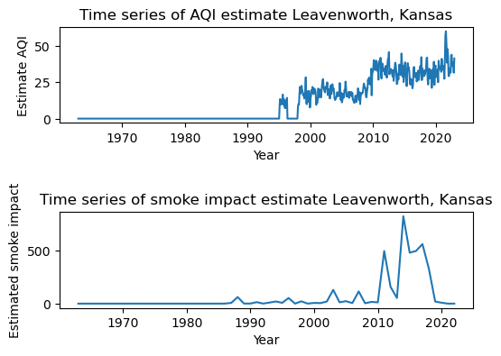

# data-512-common_analysis
Course project part 1 - Common Analysis sets the stage for the subsequent  
 assignments. In Part 1 you conduct a base analysis. All of the students in  
 the class will conduct the same analysis, but with a slightly different data subset.  

Specfically, I am assigned to look at Kansas, Leavenworth. 
(Population: 37081)
(County: Leavenworth)

# Research question:
What are the estimated smoke impacts on Leavenworth, Kansas for the last 60 years?
```
As the years go on, results show the estimated smoke impact on Leavenworth, Kansas have been 
increasing relatively. In this analysis we looked at various historical wildfire data and came up
with an estimate of the smoke impact through a specific formula.
This formula is: Smoke_impact_from_fire = (area_forest_burned * 10 * 87.5) / (distance_from_city^5)  
While it has many different flaws and assumptions, the main point of this formula is used to  
show how this estimate increases relatively over the years.  

Below is a visualizations that could potentially support this claim. Notice how both the AQI and smoke  
estimates have large increases around 2010. With that being said, the estimates used for monthly AQI  
and annual smoke estimation make it very difficult to compare the two besides using general trend, especially since data is sparse.     
```


# Annual smoke estimate information:
```
The estimate for annual smoke that I came up with is very simple. 
In this estimate I try to incorporate the volume of smoke burned by wood, the amount of 
wood burned, and the distance from the wildfire to Leavenworth. 
Unfortunately, this estimate is probably very inaccurate.

Formula: Smoke_impact_from_fire = (area_forest_burned * 10 * 87.5) / (distance_from_city^5)
To get the annual smoke estimate, we sum the smoke_impact_from_fire over every fire.

Assumptions made:
1. The volume of smoke produced by wood is 87.5 M^2 per kg [2].  
2. There is 10 kilograms of wood on average per square meter in a forest. (No source)
3. Smoke dispersion is inversely proportional to the distance to the fifth power. (Did this to keep relative scale low)

Reasons this estimate is bad:
1. The volume of smoke produced by wood depends on the type of tree.
2. More than just wood burns in a wildfire. 
3. The amount of wood on average per square meter in a forest varies on the type of flora present, the season, and other various factors.
4. Smoke dispersion is much more complicated than what I have proposed. There have been many studies on atmospheric transport models, which are much better estimates than what we have. However data for atmospheric transport models probably does not exist for our data (especially for the old stuff). 
5. Other factors that I'm not aware of

Notes:  
Overall, I decided the smoke estimate should be summed during the year because data is sparse. This means if we were to use a finer time scale we would end up with a lot of missing data that we would either have to set as an average or 0 in order to do time-series analysis. 

I did not see a reason to only use wildfires from the fire season, as smoke can effect a city at any time of the year. 

I looked for sources talking about the amount of wood per square meter in a forest but could not find anything. Therefore I arbitrarily picked a number, as the amount of smoke would scale linearly, so in terms of tracking relative change it wouldn't affect much. 
```

# Comparison of smoke estimate to AQI
```
As shown above, there seems to be a slight trend agreement between AQI and my smoke estimate for a few years. However, my smoke estimate scaling is an order of magnitude larger. Additionally, data was sparse for both problems, required a lot of averaging over time, and was calculated using multiple (likely bad) assumptions. Therefore, given all of the issues presented I believe it is safe to say my smoke estimate is bad. 
```

# Data source:
```
1. Name:  
        Combined wildland fire datasets for the United States and certain territories,   
        1800s-Present (combined wildland fire polygons)    
   Description:  
        Combination of many smaller/incomplete United States fire datasets. "Encompasses  
        known wildfires and prescribed fires within the United States and certain territories."[1]  
        In this project USGS_Wildland_Fire_Combined was used.  
   URL:  
        https://www.sciencebase.gov/catalog/item/61aa537dd34eb622f699df81    
   Schema/Info:     
        An example of the data used to store a wildfire is:
        {
            "attributes": {
              "OBJECTID": 1,
              "USGS_Assigned_ID": 1,
              "Assigned_Fire_Type": "Wildfire",
              "Fire_Year": 1860,
              "Fire_Polygon_Tier": 1,
              "Fire_Attribute_Tiers": "1 (1)",
              "GIS_Acres": 3940.20708940724,
              "GIS_Hectares": 1594.5452365353703,
              "Source_Datasets": "Comb_National_NIFC_Interagency_Fire_Perimeter_History (1)",
              "Listed_Fire_Types": "Wildfire (1)",
              "Listed_Fire_Names": "Big Quilcene River (1)",
              "Listed_Fire_Codes": "No code provided (1)",
              "Listed_Fire_IDs": "",
              "Listed_Fire_IRWIN_IDs": "",
              "Listed_Fire_Dates": "Listed Other Fire Date(s): 2006-11-02 - NIFC DATE_CUR field (1)",
              "Listed_Fire_Causes": "",
              "Listed_Fire_Cause_Class": "Undetermined (1)",
              "Listed_Rx_Reported_Acres": null,
              "Listed_Map_Digitize_Methods": "Other (1)",
              "Listed_Notes": "",
              "Processing_Notes": "",
              "Wildfire_Notice": "Wildfire mapping prior to 1984 was inconsistent, infrequent, and done
              without the aid of more modern fire mapping methods (GPS and satellite imagery). Areas 
              burned prior to 1984 in this dataset represent only a fraction of what actually burned.
              While areas burned on or after 1984 are much more accurate and complete, errors still 
              can and do occur. This dataset represents the most complete set of digitized polygon 
              fire data available to the public that we, the authors, were able to collect. It is not 
              a complete collection of all wildfires burned during the time period it represents.",
              "Prescribed_Burn_Notice": "Prescribed fire data in this dataset represents only a 
              fraction of the area burned in prescribed burns across all years due to lack of 
              reporting, particularly on private lands. The missing prescribed burn data becomes more
              pronounced further back in time, particularly in the southeastern U.S.; however, errors
              and omissions still occur through the most recent years in this dataset. This dataset
              represents the most complete set of digitized polygon fire data available to the 
              public that we, the authors, were able to collect. It is not a complete collection of
              all prescribed burns burned during the time period it represents.",
              "Wildfire_and_Rx_Flag": null,
              "Overlap_Within_1_or_2_Flag": null,
              "Circleness_Scale": 0.04758958417643999,
              "Circle_Flag": null,
              "Exclude_From_Summary_Rasters": "No",
              "Shape_Length": 64888.449849380544,
              "Shape_Area": 15945452.365353702
            },
            "geometry": {
                "rings": [.....]
            },
        }
```

# Description of all project directories and files

```
./Archive/ - Collection of example files or files that are no longer needed
    1. ./Archive/epa_air_quality_history_example.ipynb - Example of requesting data from the EPA AQS api. 
    2. ./Archive/wildfire_geo_proximity_example.ipynb - Example of how to perform distance calculations on
                                              geodectic data as well as load in/process geojson data.  
```

```
./Data/ - Directory of all relevant data files to this project. Most data is gitingored.   
    1. ./Data/USGS_Wildland_Fire_Combined_Dataset.json - Wildland Fire polygons in GeoJSON format
    2. ./Data/USGS_Wildland_Fire_Combined_WithDistances.json - Wildland Fire polygons in GeoJSON format
                                                        that include the average distance from the
                                                        polygon points to Leavenworth, Kansas
```

```
./Images/
    1. ./Images/FireOccurenceHistogram.png - See ./Reports/CommonAnalysisReflections.pdf
    2. ./Images/AcresTimeSeries.png - See ./Reports/CommonAnalysisReflections.pdf
    3. ./Images/SmokeAndAQITimeSeries.png - See ./Reports/CommonAnalysisReflections.pdf
```

```
./Reports/
    1. ./Reports/CommonAnalysisReflections.docx - Written report on reflections for part 1 of the project
    2. ./Reports/CommonAnalysisReflections.pdf - Written report on reflections for part 1 of the project
```

```
./Src/ - Directory containing main project files and notebooks
    1. ./Src/wildfire/
        1. ./Src/wildfire/__init__.py - Empty, needed for python modules to work correctly
        2. ./Src/wildfire/extract_subset.py - Test to see if Author could figure out GeoJSON access and 
                                              extracting a subset of a large file (not important)
        3. ./Src/wildfire/Reader.py - Module that implements a simple streaming reader which is
                                      compatible with the GeoJSON data formats for the
                                      wildfire datasets provided by the USGS.
        4. ./Src/wildfire/test_geocalc.py - Test to see if author could figure out geodectic 
                                            calculations (Not important)
        5. ./Src/wildfire/Widlfire_short_sample.json - Example geojson data
    2. ./Src/CommonAnalyis.ipynb - Notebook that has all of the relevant code and results for this 
                                   analysis  
``` 
./environment.yml - Anaconda development environment file    
./gitignore - Prevents certain files from being pushed to the repository  
./LICENSE - MIT LICENSE statement   
./README.md - Project documentation (This file)  

# Commands
conda env create -f enviroment.yml  
python -m ipykernel install --user --name=Data512Project  

# References
1. https://www.sciencebase.gov/catalog/item/61aa537dd34eb622f699df81 
2. http://virtual.vtt.fi/virtual/innofirewood/stateoftheart/database/burning/burning.html#:~:text=In%20well%20ventilated%20conditions%2C%20the,the%20smoke%20production%20of%20wood 